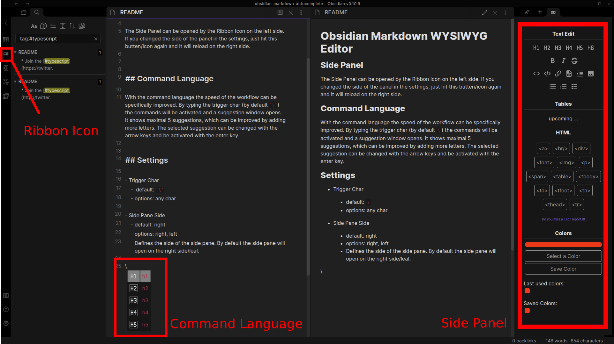
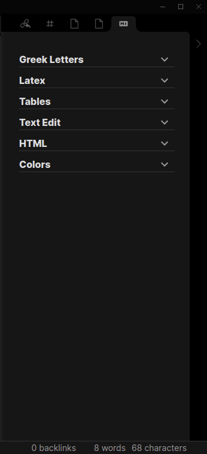
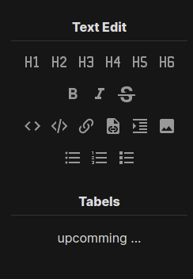
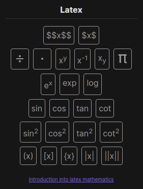
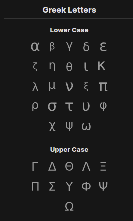
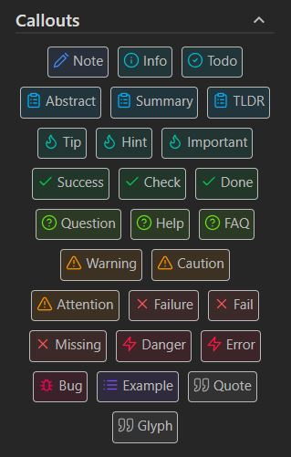
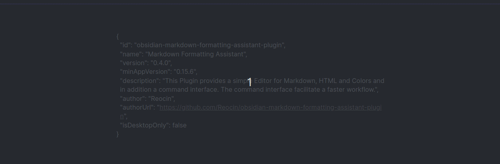
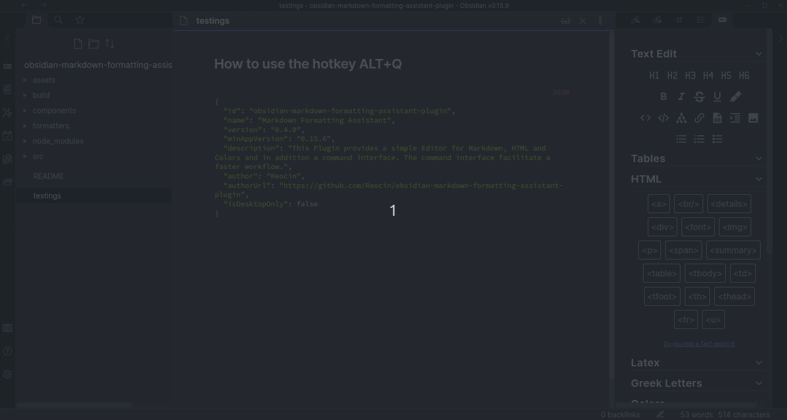

# Obsidian Markdown Formatting Assistant

> This Plugin provides easy to use snippets for Markdown, Latex and Callout for obsidian.

> If you find a Bug or have a feature request: https://github.com/zhangpanzhan/obsidian-markdown-formatting-assistant-plugin/issues

## Side Panel

The Side Panel can be opened by the Ribbon Icon on the left side. If you changed the side (left or right) of the panel in the settings, just hit this butten/icon again and it will reload on the right side.

### Order and expansion of the Sections

It is possible to change the order of the sections according to the personal wishes. Furthermore it is possible to expand and shrink every section to keep the overview.

### Markdown Section

### Latex Section

> Latex Functions only work if they are in a latex equation section like $...$ or $$...$$.

### Greek Letters Section

> Greek Letters only work if they are in a latex equation section like $...$ or $$...$$.

### Callouts Section

## Suggestion Window with Shortcut

This plugin does have a default shortcut `ALT+Q` which opens a Suggestion Window with all commands of this plugin (except colors and callouts). Once you get used to it, you want never miss it again. Furthermore, this way there is no need to ever leave your keyboard!

With the default shortcut `ALT-C` a Suggestion Window for Callouts is opened with the same functionality like the common Suggestion Window.

### How it works
Just press the shortcut/hotkey `ALT+Q` on any place. It doesn't matter if you are on a specific position or selected some text you want to change. Then enter the name of the command you want to apply. After a few letters your wished command should be suggested in the top 5.

### How to change the shortcut/hotkey

The shortcut/hotkey `ALT+Q` was selected becaus it can be  comfortable reached with just one hand, but you can change it to what ever you want.

## Settings

- Side Pane Side

  - default: right
  - options: right, left
  - Defines the side of the side pane. By default the side pane will open on the right side/leaf.
